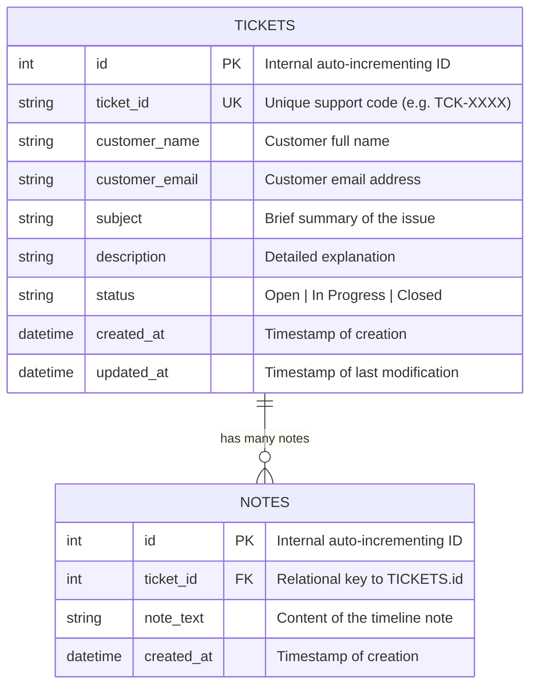

# Horizon — Customer Support CRM Ticketing System

A premium, full-stack CRM Ticketing System built for customer support teams to manage, search, and track customer issues effortlessly. This application features a high-performance **FastAPI** backend and an extremely sleek, responsive, dark-mode **React** frontend.

---

## 🌟 Key Features

*   **Premium Dark UI/UX:** Styled using custom CSS variables and Tailwind CSS, featuring subtle glassmorphism, responsive navigation, custom scrollbars, and dynamic state styling.
*   **Create Tickets:** Multi-column validation form allowing customers to submit issues with instant unique ticketing ID assignment.
*   **Interactive Dashboard:** View all tickets inside a responsive grid with status indicators.
*   **Debounced Live Search:** Fast real-time ticket search across subjects, descriptions, or IDs that automatically debounces keystrokes to minimize backend load.
*   **State-based Tab Filtering:** Effortlessly filter tickets instantly between **All**, **Open**, **In Progress**, and **Closed** states.
*   **Ticket Timeline & Internal Notes:** A complete detail view including ticket metadata, status resolution actions, and an **activity timeline** for adding unlimited internal logs (One-to-Many relationship).

---

## 🛠️ Tech Stack

### Backend
*   **Core Framework:** Python 3.10+, FastAPI
*   **Database (SQL):** SQLite (Local file-based `crm.db`)
*   **ORM:** SQLAlchemy (Relational models mapping and session management)
*   **Server:** Uvicorn (ASGI web server)

### Frontend
*   **Framework:** React 18 (Vite-powered for instant HMR)
*   **Styling:** Tailwind CSS, Custom CSS Variables (Glassmorphic variables)
*   **Icons:** Lucide React
*   **Routing:** React Router v6

---

## 📊 Database Architecture

The SQL database contains two core tables mapped using a relational **One-to-Many** design:



---

## 🚀 Running Locally

Follow these instructions to spin up the local development environment:

### Prerequisite Checklist
*   Python 3.10+ installed
*   Node.js 18+ installed

---

### Step 1: Run the Backend Server
1. Navigate to the `backend` folder:
   ```bash
   cd backend
   ```
2. Create a virtual environment:
   ```bash
   python3 -m venv venv
   ```
3. Activate the environment:
   * **macOS/Linux:**
     ```bash
     source venv/bin/activate
     ```
   * **Windows:**
     ```bash
     venv\Scripts\activate
     ```
4. Install all Python dependencies:
   ```bash
   pip install -r requirements.txt
   ```
5. Launch the FastAPI server:
   ```bash
   uvicorn main:app --reload
   ```
   *The backend will boot up locally at:* `http://localhost:8000`

---

### Step 2: Run the Frontend Server
1. Open a new terminal and navigate to the `frontend` folder:
   ```bash
   cd frontend
   ```
2. Install npm packages:
   ```bash
   npm install
   ```
3. Boot the React development server:
   ```bash
   npm run dev
   ```
   *Open your browser and navigate to:* `http://localhost:5173`

---

## ☁️ Deployment Guidelines

### 1. Backend (Railway or Render)
*   **Environment:** Python
*   **Root Directory:** `backend`
*   **Build Command:** `pip install -r requirements.txt`
*   **Start Command:** `uvicorn main:app --host 0.0.0.0 --port $PORT`

### 2. Frontend (Vercel)
*   **Framework Preset:** Vite
*   **Root Directory:** `frontend`
*   **Environment Variables:** Add `VITE_API_URL` pointing to your deployed backend API URL (e.g., `https://your-backend.onrender.com/api/tickets`).
